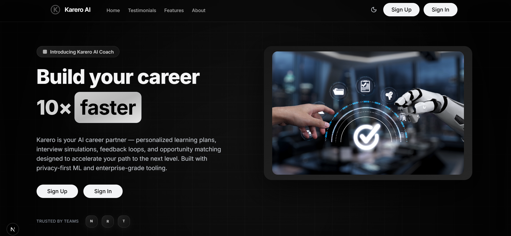
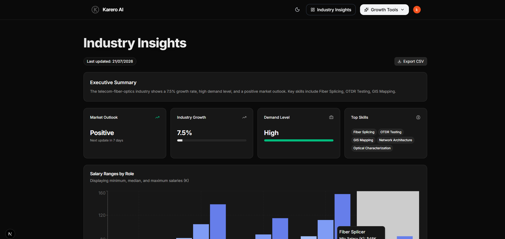

<div align="center">

# Karero AI

**Your personal AI-powered career coach.**

Resume building, cover letters, mock interviews, and real-time industry insights — all in one place.

[](https://nextjs.org/)
[](https://www.typescriptlang.org/)
[](https://clerk.com/)
[](https://ai.google.dev/)
[](https://www.prisma.io/)
[](https://tailwindcss.com/)

[Live Demo](#) · [Report Bug](#) · [Request Feature](#)

</div>

---

## Table of contents

- [About the project](#about-the-project)
- [Screenshots](#screenshots)
- [Features](#features)
- [Tech stack](#tech-stack)
- [Getting started](#getting-started)
  - [Prerequisites](#prerequisites)
  - [Installation](#installation)
  - [Environment variables](#environment-variables)
  - [Running locally](#running-locally)
- [Project structure](#project-structure)
- [Background jobs](#background-jobs)
- [Roadmap](#roadmap)
- [Contributing](#contributing)
- [License](#license)
- [Contact](#contact)

---

## About the project

**Karero AI** is a full-stack, AI-driven career development platform built to help job seekers move confidently toward their dream roles. It combines generative AI with real industry data to deliver personalized guidance at every stage of the job search — from building a standout resume to acing the final interview.

Whether you're switching careers, entering the workforce for the first time, or leveling up in your current field, Karero AI acts as an always-available coach that adapts to your industry, role, and goals.

---

## Screenshots

<div align="center">

### Landing page


### Dashboard


</div>

---

## Features

- **AI industry insights** — real-time salary ranges, demand levels, growth rate, market outlook, key trends, and recommended skills for your industry, auto-refreshed on a weekly schedule.
- **AI resume builder** — generate and refine ATS-friendly resumes tailored to your target role.
- **AI cover letter generator** — create personalized, role-specific cover letters in seconds.
- **Interview preparation quiz** — practice with AI-generated, industry-relevant interview questions and get instant feedback on your performance.
- **Authentication & user management** — secure sign-up, sign-in, and profile management powered by Clerk.
- **Dark / light mode** — a polished, theme-aware interface that adapts to your preference.
- **Responsive design** — a seamless experience across desktop, tablet, and mobile.

---

## Tech stack

| Layer              | Technology                                   |
|---------------------|-----------------------------------------------|
| Framework           | [Next.js](https://nextjs.org/) (App Router)   |
| Language            | TypeScript                                   |
| Authentication      | [Clerk](https://clerk.com/)                  |
| AI / LLM            | [Google Gemini API](https://ai.google.dev/)  |
| Database ORM        | [Prisma](https://www.prisma.io/)             |
| Background jobs     | [Inngest](https://www.inngest.com/)          |
| Styling             | Tailwind CSS                                 |
| Animation           | Framer Motion                                |
| UI components       | shadcn/ui, Lucide Icons                      |

---

## Getting started

Follow these steps to get a local copy up and running.

### Prerequisites

- Node.js `v18` or later
- npm, yarn, or pnpm
- A PostgreSQL (or compatible) database instance
- A [Clerk](https://clerk.com/) account and application
- A [Google AI Studio](https://aistudio.google.com/) Gemini API key
- An [Inngest](https://www.inngest.com/) account (for scheduled AI insight updates)

### Installation

1. Clone the repository

   ```bash
   git clone https://github.com/krishnasahu22032003/karero
   cd karero-ai
   ```

2. Install dependencies

   ```bash
   npm install
   ```

3. Generate the Prisma client and run migrations

   ```bash
   npx prisma generate
   npx prisma migrate dev
   ```

### Environment variables

Create a `.env.local` file in the root directory and add the following:

```env
# Database
DATABASE_URL="your_postgresql_connection_string"

# Clerk
NEXT_PUBLIC_CLERK_PUBLISHABLE_KEY="your_clerk_publishable_key"
CLERK_SECRET_KEY="your_clerk_secret_key"
NEXT_PUBLIC_CLERK_SIGN_IN_URL="/sign-in"
NEXT_PUBLIC_CLERK_SIGN_UP_URL="/sign-up"

# Gemini API
GEMINI_API_KEY="your_gemini_api_key"

# Inngest
INNGEST_EVENT_KEY="your_inngest_event_key"
INNGEST_SIGNING_KEY="your_inngest_signing_key"
```

> For local development only, you can set `INNGEST_DEV=1` instead of the Inngest keys to run against the local Inngest Dev Server.

### Running locally

Start the Next.js development server:

```bash
npm run dev
```

In a separate terminal, start the Inngest Dev Server to enable background jobs (e.g. weekly AI insight refresh):

```bash
npx inngest-cli@latest dev
```

Open [http://localhost:3000](http://localhost:3000) in your browser to see the app.

---

## Project structure

```
karero-ai/
├── app/                    # Next.js App Router pages & layouts
│   ├── (main)/             # Public marketing pages
│   ├── dashboard/          # Authenticated dashboard
│   ├── resume/             # AI resume builder
│   ├── ai-cover-letter/    # AI cover letter generator
│   ├── interview/          # Interview prep quiz
│   └── api/inngest/        # Inngest serve endpoint
├── components/             # Reusable UI components
├── lib/                    # Prisma client, Clerk helpers, utilities
├── inngest/                # Scheduled background functions
├── prisma/                 # Prisma schema & migrations
├── public/                 # Static assets
└── screenshots/            # README screenshots
```

---

## Background jobs

Karero AI uses [Inngest](https://www.inngest.com/) to keep industry insights fresh without manual intervention. A scheduled function runs weekly to:

1. Fetch all distinct industries currently stored in the database.
2. Query the Gemini API for updated salary ranges, demand levels, growth rates, and market trends.
3. Normalize and persist the results, updating `lastUpdated` and `nextUpdate` timestamps.

This ensures every user always sees current, relevant insights for their field — no manual refresh required.

---

## Roadmap

- [ ] AI-powered LinkedIn profile optimization
- [ ] Multi-language resume generation
- [ ] Downloadable PDF exports for resumes and cover letters
- [ ] Team / recruiter dashboard
- [ ] Mobile app companion

See the [open issues](#) for a full list of proposed features and known issues.

---

## Contributing

Contributions make the open-source community an incredible place to learn, inspire, and create. Any contributions you make are **greatly appreciated**.

1. Fork the project
2. Create your feature branch (`git checkout -b feature/AmazingFeature`)
3. Commit your changes (`git commit -m 'Add some AmazingFeature'`)
4. Push to the branch (`git push origin feature/AmazingFeature`)
5. Open a Pull Request

---

## License

Distributed under the MIT License. See `LICENSE` for more information.

---

## Contact

**Krishna Sahu**

📧 [krishna.sahu.work@gmail.com](mailto:krishna.sahu.work@gmail.com)

Project link: [https://kareroai.krishnastack.com](#)

---

<div align="center">

Made with ❤️ by **Krishna Sahu**

</div>